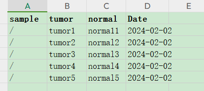

# ESCC-WGS
WGS analysis for metastatic esophageal squamous cell carcinoma
## Ownership
ESCC-WGS流程是由**GuoLab**团队开发的，点击[这里](https://guolab.wchscu.cn/)进入实验室主页，了解使用条款。
<br>
<br>
## 流程的整体描述
**ESCC-WGS**流程是想对**全基因组测序**（Whole Genome Sequencing, WGS）原始数据进行分析和处  
理的，分析的内容包括：
- 1. SNV and indel calling；
- 2. Copy number analysis and LOH identification（更新中）；
- 3. structure variants detections（后续）；
- 4. 后续的更多分析。 

流程包含体细胞突变模块和胚系突变模块。
<br>
<br>
## 流程的方法描述
### 体细胞突变检测部分
#### 数据质控和过滤
FastQC评估碱基测序质量，multiqc汇总所有样本评估结果（因为是用snakemake将样本分开跑的，  
可能有些样本已经跑了很多步，有些样本还没开始跑，所以multiqc不一定是在第一步跑的）。如果  
测序质量较好（一般都是除了GC含量不太正常外，其他指标PASS），会直接进行序列比对<sup>[[1]](https://www.ncbi.nlm.nih.gov/pmc/articles/PMC8421382/)</sup>；  
否则用fastp使用默认参数，去除接头和低质量序列。
#### 比对到基因组

#### 标记去重复

#### 序列重新比对

#### 碱基质量校对

#### SNV and indel calling

#### Copy number analysis and LOH identification
等待后续更新

#### structure variants detections
等待后续更新

### 胚系突变检测部分
等待后续更新
<br>
<br>
## 流程的相关依赖
### 依赖的软件
FastQC (v0.11.1): https://www.bioinformatics.babraham.ac.uk/projects/fastqc/  
SAMtools (v1.12)：https://github.com/samtools/samtools  
picard (v2.25.5): https://github.com/broadinstitute/picard/releases/download/2.25.5/picard.jar  
bwa* (v0.7.17-r1188): http://sourceforge.net/projects/bio-bwa/  
fastq-dump (v3.0.6): https://ftp.ncbi.nlm.nih.gov/sra/sdk/current/  
java* (v17.0.9): https://www.oracle.com/cn/java/  
fastp (v0.23.4): https://github.com/OpenGene/fastp  
GATK* (v4.5.0.0): https://github.com/broadinstitute/gatk  
snakemake* (v7.32.4): https://pypi.org/project/snakemake/  
MultiQC (v1.19): https://pypi.org/project/multiqc/  
R (v4.1.0): /   
python(2.7.17): /    
&emsp;&emsp;note: 标记`“*”`的软件是说在流程中作用相对重要，不可或缺~~

### 依赖的数据库和除测序数据之外的输入文件
&emsp;&emsp;**bwa比对时用到的基因组版本，应该和gatk分析用的基因组版本保持一致**；   
&emsp;&emsp;gatk变异检测时用到的数据库和文件，包括基因组及其索引文件，都可以从gatk官网的Resource/bundle路径下    
"ftp://gsapubftp-anonymous@ftp.broadinstitute.org/bundle/"下载，但是需要借助lftp工具下载，所以请先安装lftp,   
下载的话，`lftp {url}`登录，`mirror hg38`下载整个目录，`get {file}` 具体文件。    
<br>
<br>
## 流程的使用说明
### 在本地上运行
如果还没有获取到流程，点击[链接](https://github.com/xieguiyan/ESCC-WGS)进入github下载。

#### 快速入手 
  工具`Autoconfig.py`可以引导和帮助您快速入手，使用方法参考下面的简单例子    
```
 Command: python3 Autoconfig.py -w workp/  -d rawdata/ -s sample.info  -r
```  
&emsp;&emsp;参数描述：  
&emsp;&emsp;&emsp;&emsp;&emsp;-s/--sample-information: 记录样本信息的表格  
&emsp;&emsp;&emsp;&emsp;&emsp;-r/--run: 配置好运行的条件之后，不再询问您，直接运行    
```
python3 Autoconfig.py -h # 查看更多的帮助信息和参数设置方法。    
```
**样品信息的表格**sample.info的格式如下：  

<div align=left> </div>

&emsp;&emsp;备注：制表符`\t`分开，**列名“sample”、“tumor”和“normal”是固定的和不可修改的**。体细胞突变检测  
是用**Mutect2的tumor_vs_normal模式**做的，换句话说，如果要做体细胞突变检测，“tumor”和“normal”那两   
列是要必须要有的；其他情况下，如不用明确肿瘤样本和正常样本，那就把样本信息填写在“sample”那列。  

#### 按步骤来配置和使用流程
按步骤配置来使用流程，用于 `“快速入手”`不能完成**ESCC-WGS**流程的参数修改和使流程顺利开始运行  
的时候，或者用户想自己配置流程的相关细节的时候。  
步骤描述如下：  
&emsp;&emsp;步骤1：修改工作脚本work.smk里面的参数*workp*，从而指定work.smk的配置文件work.WGS.yaml在哪:   
$workp/work.WGS.yaml；

&emsp;&emsp;步骤2：修改配置文件work.WGS.yaml里面的参数，其中，*workp*、*rawdata*和 *sampleinformation* 3个  
参数是每次分析都必须要修改的，其他参数，1) 对于使用到的软件和其他文件数据库等，是流程依赖的，请在第一次使用  
的时候配置正确，2)分析依赖的参数请根据实验需求进行选择性的修改；    

&emsp;&emsp;步骤3：确认没问题之后，运行的命令 `“nohup snakemake -s work.smk --cores 64 1>run.o 2>&1”`  
(如果snakemake没有添加到您的环境变量里，这里的snakemake换成绝对/相对路径)，就可以正式开始  
分析。所以，使用前请先下载安装好[snakemake](https://pypi.org/project/snakemake/)，查看[手册](https://snakemake.readthedocs.io/en/stable/)了解更多的相关命令     

&emsp;&emsp;步骤4（可选的）：到步骤3，其实**ESCC-WGS**已经可以正常运行了，但是一般在集群上有专门的资源和  
任务调度系统(如slurm和LSF)，所以建议您换种方式，如用slurms系统，编辑run.sh内容如下：    
 ```
 #!/bin/bash
 #SBATCH -p cn
 #SBATCH -J ESCC-WGS
 #SBATCH -N 1
 #SBATCH -n 64
 #SBATCH -O run.o
 #SBATCH -e run.e
 snakemake -w work.smk --cores 64 1>run.o 2>&1
 ```
接着 `sbatch run.sh`投递就可以。
<br>
<br>
### 使用Docker
等待后续更新

<br>
<br>
<br>
<br>
------
~~THE END ~~ 


